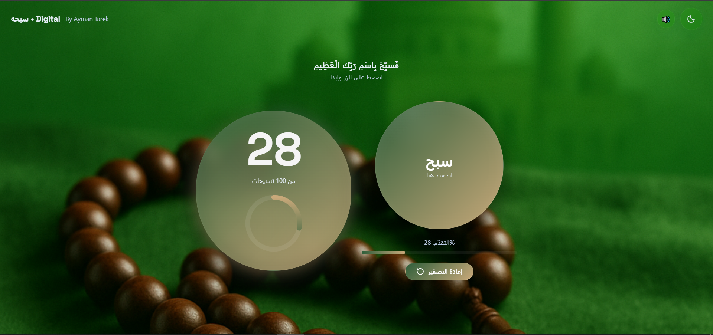
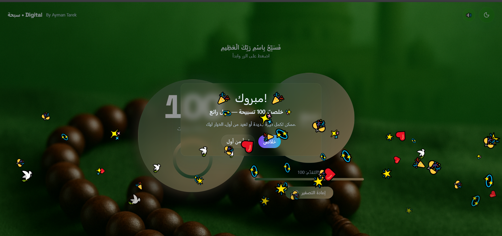

# Digital Tasbeeh

Digital Tasbeeh is a modern **interactive digital Tasbeeh (prayer beads) application** built with **React** and **TailwindCSS**. It offers a smooth, engaging, and visually appealing way to perform tasbeeh on **mobile and desktop devices**.

---

## 🌟 Features

- **Interactive Circular Counter**  
  A glowing circular counter shows your progress clearly, giving a satisfying visual feedback for every tasbeeh.

- **Big Tasbeeh Button**  
  Press a large, elegant digital button that simulates a real tasbeeh. Animations and subtle effects enhance the experience.

- **Reset Button**  
  You can **reset your count** at any time with a stylish reset button, starting from zero again.

- **Dark & Light Mode**  
  Easily switch between **dark and light themes** with a single click. The theme instantly updates your UI colors for comfortable usage at any time.

- **Sound Feedback**  
  Each tap plays a subtle click sound. You can toggle the sound on or off according to your preference.

- **Celebratory Confetti**  
  When you reach your target (default: 100 tasbeehs), a colorful confetti animation bursts from the top, giving a delightful feeling of accomplishment.

- **Persistent Progress**  
  Your current count is **saved automatically** in the browser. You can refresh the page or close it, and your progress will remain intact.

- **Progress Visualization**  
  Shows a percentage progress bar below the main button, updating in real-time as you count.

- **Offline Support & PWA**  
  The app can be installed as a **Progressive Web App (PWA)**, allowing you to use it **offline**. Once installed, it behaves like a native app on both desktop and mobile.

---

## 📸 Screenshots

**Home Screen:**



**Target Achieved Screen:**



---

## 🚀 Installation

1. Clone the repository:

```bash
git clone <your-repo-url>
cd digital-tasbeeh
